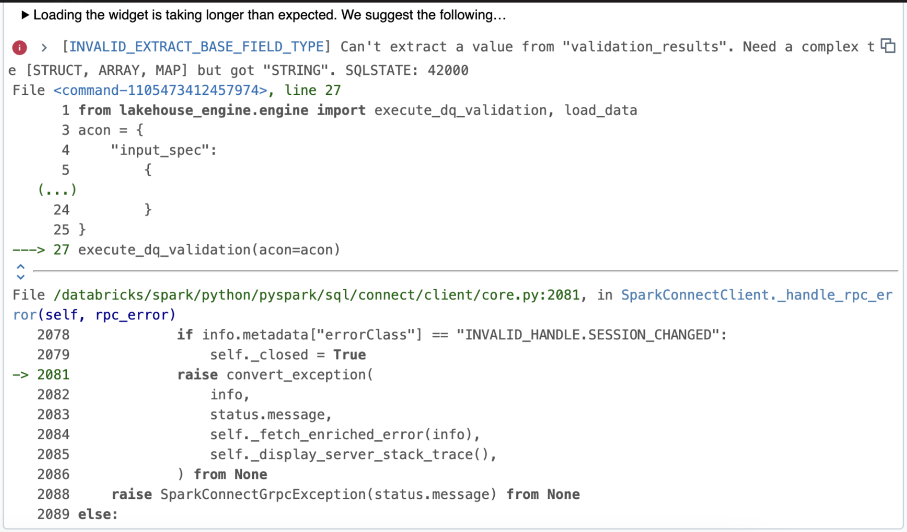
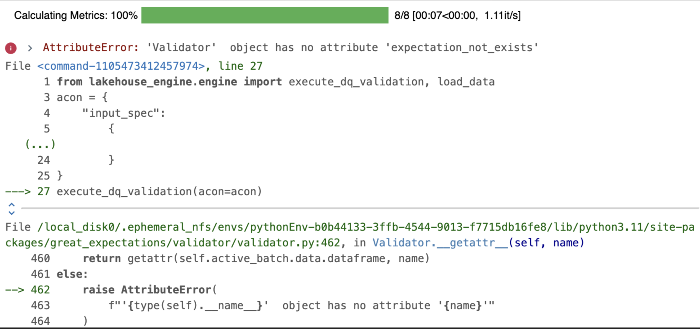
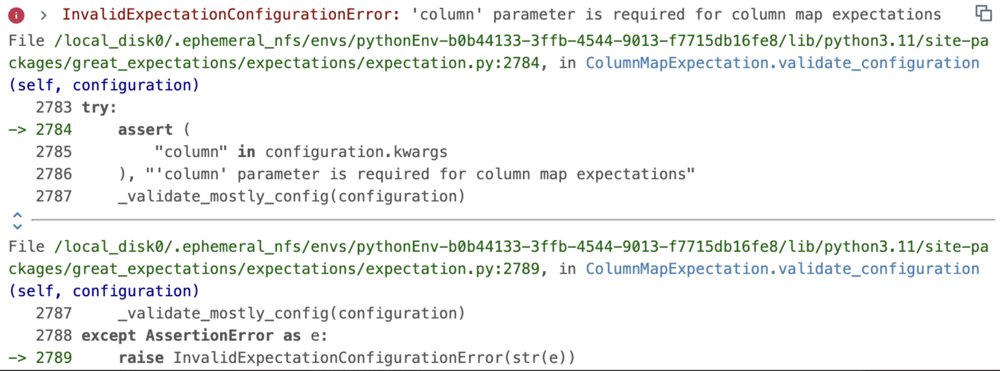

# Prisma

Prisma is part of the Lakehouse Engine DQ Framework, and it allows users to read DQ functions dynamically from a table instead of writing them explicitly in the Acons.


## How to use Prisma?
- Use the Lakehouse Engine version: 1.22.0 or later;
- Use DBR 13.3 or later.  If you are not using Databricks, ensure a similar environment with Spark 3.4.1 and Delta 2.4.0.
- Create the DQ Checks in a table in your Data Product:
  - Each data quality check conducted in Prisma will be hosted within the bucket defined in the engine config file (lakehouse_engine/configs/engine.yaml). Consequently, the result sink location will receive the results of their assessments at the granularity of each "run", capturing all records generated during every operation. The DQ Checks table is located in the demanding data product and can have any name (i.e: data_quality_checks).
  - The idea is for it to be a central bucket for all DPs to ensure easier and better observability and unlock offering of easier insights over the Data Quality of the Lakehouse.
  
Below you find a DDL example with the expected schema and description for the fields:
```sql
DROP TABLE IF EXISTS my_database.data_quality_checks;
CREATE EXTERNAL TABLE my_database.data_quality_checks (
  dq_rule_id STRING COMMENT 'DQ Rule ID.',
  dq_tech_function STRING COMMENT 'Great Expectations function type to apply according to the DQ rules type. Example: expect_column_to_exist.',
  execution_point STRING COMMENT 'In motion/At rest.',
  schema STRING COMMENT 'The database schema on which the check is to be applied.',
  table STRING COMMENT 'The table on which the check is to be applied.',
  column STRING COMMENT 'The column (either on Lakehouse or in other accessible source systems, such as FDP or SAP BW) on which the check is to be applied.',
  filters STRING COMMENT 'General filters to the data set (where part of the statement). Note: this is purely descriptive at this point as there is no automated action/filtering of the Lakehouse Engine or PRISMA upon it.',
  arguments STRING COMMENT 'Additional arguments to run the Great Expectation Function in the same order as they appear in the function. Example: {"column": "amount", "min_value": 0}.',
  dimension STRING COMMENT 'Data Quality dimension.'
)
USING DELTA
LOCATION 's3://my-data-product-bucket/inbound/data_quality_checks'
COMMENT 'Table with dummy data mapping DQ Checks.'
TBLPROPERTIES(
  'lakehouse.primary_key'='dq_rule_id',
  'delta.enableChangeDataFeed'='true'
)
```
**Data sample:**

| dq_rule_id | dq_tech_function                          | execution_point | schema             | table       | column       | filters | arguments                                         | dimension    |
|------------|:------------------------------------------|:----------------|:-------------------|:------------|:-------------|:--------|:--------------------------------------------------|--------------|
| 1          | expect_column_values_to_not_be_null       | at_rest         | my_database_schema | dummy_sales | ordered_item |         | {"column": "ordered_item"}                        | Completeness |
| 2          | expect_column_min_to_be_between           | in_motion       | my_database_schema | dummy_sales | ordered_item |         | {"column": "amount", "min_value": 0}              | Completeness |
| 3          | expect_column_values_to_not_be_in_set     | in_motion       | my_database_schema | dummy_sales | ordered_item |         | {"column": "amount", "value_set": [1,2,3]}        | Completeness |
| 4          | expect_column_pair_a_to_be_not_equal_to_b | at_rest         | my_database_schema | dummy_sales | ordered_item |         | {"column_A": "amount","column_B": "ordered_item"} | Completeness |
| 5          | expect_table_row_count_to_be_between      | at_rest         | my_database_schema | dummy_sales | ordered_item |         | {"min_value": 1, "max_value": 10}                 | Completeness |

**Table definition:**

| Column Name      | Definition                                                                                                                                                                                                                                                                        |
|------------------|-----------------------------------------------------------------------------------------------------------------------------------------------------------------------------------------------------------------------------------------------------------------------------------|
| dq_rule_id       | The identifier of a data quality rule.                                                                                                                                                                                                                                            |
| dq_tech_function | Type of Great Expectations function to apply according to the DQ rules type. See the values here: [Gallery of Expectations and Packages](https://greatexpectations.io/legacy/v1/expectations/?filterType=Backend+support&viewType=Summary&showFilters=true&subFilterValues=spark) |
| execution_point  | The way how validations will be performed on top the the data set. List of values: at_rest, in_motion.                                                                                                                                                                            |
| schema           | The schema on which the check is to be applied.                                                                                                                                                                                                                                   |
| table            | The table on which the check is to be applied.                                                                                                                                                                                                                                    |
| column           | The column on which the check is to be applied.                                                                                                                                                                                                                                   |
| filters          | General filters to the data set (where part of the statement). **Note**: this is purely descriptive at this point as there is no automated action/filtering of the Lakehouse Engine or PRISMA upon it.                                                                            |
| arguments        | Additional arguments to run the Great Expectation Function in the same order as they appear in the function.                                                                                                                                                                      |
| dimension        | Categorisation of a DQ rule related to one of the dimensions. List of values: Completeness, Uniqueness, Timeliness, Validity, Consistency, Accuracy. **Note**: these values are purely descriptive.                                                                               |

**Execution behaviour** - The value of the **execution_point** column determines the type of Acon execution:

  - **For records at_rest**, they will only be processed when the Lakehouse engine is called by the execute_dq_validation() function.

  - **For records in_motion**, they will only be processed when the Lakehouse engine is called by load_data() function.

## What are the main changes on my ACON if I already implemented DQ?

The following configurations represent the minimum requirements to make Prisma DQ work.

- **dq_type:** "prisma" - the value must be set in order for the engine process the DQ with Prisma;
- **store_backend:** "file_system" or "s3" - which store backend to use;
  - **bucket** - the bucket name to consider for the store_backend (store DQ artefacts). **Note**: only applicable and mandatory for store_backend s3.
  - **local_fs_root_dir:** path of the root directory. **Notes**: only applicable for store_backend file_system;
- **dq_db_table:** the DQ Check table that is located in the demanding data product;
- **dq_table_table_filter:** name of the table which rules are to be applied in the validations. The table name must match with the values inserted in the column "table" from dq_db_table;
- **data_product_name:** the name of the data product;
- **tbl_to_derive_pk or unexpected_rows_pk:**
  - tbl_to_derive_pk - automatically derive the primary keys from a given database table. **Note**: the primary keys are derived from the **lakehouse.primary_key** property of a table.   
  - unexpected_rows_pk - the list of columns composing the primary key of the source data to identify the rows failing the DQ validations.

**DQ Prisma Acon example**
```python
"dq_specs": [
  {
    "spec_id": "dq_validator_in_motion",
    "input_id": "dummy_sales_transform",
    "dq_type": "prisma",
    "store_backend": "file_system",
    "local_fs_root_dir": "/my-data-product/artefacts/dq",
    "dq_db_table": DQ_DB_TABLE,
    "dq_table_table_filter": "dummy_sales",
    "data_product_name": DATA_PRODUCT_NAME,
    "tbl_to_derive_pk": DB_TABLE,
  }
],
```

!!! note
    Available extra parameters to use in the DQ Specs for Prisma:
    
    - **data_docs_local_fs** - the path for data docs. The parameter is useful in case you want your DQ Results to be reflected on the automatic Data Docs site;
    - **data_docs_prefix** - prefix where to store data_docs' data. This parameter must be used together with `data_docs_local_fs`;
    - **dq_table_extra_filters** - extra filters to be used when deriving DQ functions. This is an SQL expression to be applied to `dq_db_table` which means that the statements must use one of the available columns in the table. For example: dq_rule_id in ('rule1','rule2');
    - **data_docs_bucket** - the bucket name for data docs only. When defined, it will supersede bucket parameter. **Note:** only applicable for store_backend s3;
    - **expectations_store_prefix** - prefix where to store expectations' data. **Note:** only applicable for store_backend s3;
    - **validations_store_prefix** - prefix where to store validations' data. **Note:** only applicable for store_backend s3;
    - **checkpoint_store_prefix** - prefix where to store checkpoints' data. **Note:** only applicable for store_backend s3;

## End2End Example
Below you can also find an End2End and detailed example of loading data into the DQ Checks table and then using PRISMA both with load_data() and execute_dq_validation().

??? example "**1 - Load the DQ Checks Table**"
    This example shows how to insert data into the data_quality_checks table using an Acon with a csv file as a source.
    The location provided is just an example of a place to store the csv. It is also important that the source file contains the **data_quality_checks** schema.
    ```python
    acon = {
      "input_specs": [
        {
        "spec_id": "read_dq_checks",
        "read_type": "batch",
        "data_format": "csv",
        "options": {"header": True, "delimiter": ";"},
        "location": "s3://my-data-product/local_data/data_quality_checks/",
        }
      ],
      "output_specs": [
        {
        "spec_id": "write_dq_checks",
        "input_id": "read_dq_checks",
        "write_type": "overwrite",
        "data_format": "delta",
        "location": "s3://my-data-product-bucket/inbound/data_quality_checks",
        }
      ],
    }
    
    load_data(acon=acon)
    ```

??? example "**2 - PRISMA - IN MOTION (load_data)**"
    ```python
    cols_to_rename = {"item": "ordered_item", "date": "order_date", "article": "article_id"}   
    acon = {
        "input_specs": [
            {
                "spec_id": "dummy_sales_bronze",
                "read_type": "batch",
                "data_format": "delta",
                "location": "s3://my-data-product-bucket/bronze/dummy_sales",
            }
        ],
        "transform_specs": [
            {
                "spec_id": "dummy_sales_transform",
                "input_id": "dummy_sales_bronze",
                "transformers": [
                    {
                        "function": "rename",
                        "args": {
                            "cols": cols_to_rename,
                        },
                    },
                ],
            }
        ],
        "dq_specs": [
            {
                "spec_id": "dq_validator_in_motion",
                "input_id": "dummy_sales_transform",
                "dq_type": "prisma",
                "store_backend": "file_system",
                "local_fs_root_dir": "/my-data-product/artefacts/dq",
                "dq_db_table": DQ_DB_TABLE,
                "dq_table_table_filter": "dummy_sales",
                "dq_table_extra_filters": "1 = 1",
                "data_docs_local_fs": "my-data-product/my-data-product-dq-site",
                "data_docs_prefix": "{}/my-data-product-bucket/data_docs/site/".format(DQ_PREFIX),
                "data_product_name": DATA_PRODUCT_NAME,
                "tbl_to_derive_pk": DB_TABLE,
            }
        ],
        "output_specs": [
            {
                "spec_id": "dummy_sales_silver",
                "input_id": "dq_validator_in_motion",
                "write_type": "overwrite",
                "data_format": "delta",
                "location": "s3://my-data-product-bucket/silver/dummy_sales_dq_template_in_motion",
            }
        ],
    }
    
    load_data(acon=acon)
    ```

??? example "**3 - PRISMA - AT REST (exec_dq_validation)**"
    ```python
    acon = {
        "input_spec": {
            "spec_id": "dummy_sales_source",
            "read_type": "batch",
            "db_table": DB_TABLE,
        },
        "dq_spec": {
            "spec_id": "dq_validator_at_rest",
            "input_id": "sales_input",
            "dq_type": "prisma",
            "store_backend": "file_system",
            "local_fs_root_dir": "/my-data-product/artefacts/dq",
            "dq_db_table": DQ_DB_TABLE,
            "dq_table_table_filter": "dummy_sales",
            "data_docs_local_fs": "my-data-product/my-data-product-dq-site",
            "data_docs_prefix": "{}/my-data-product-bucket/data_docs/site/".format(DQ_PREFIX),
            "data_product_name": DATA_PRODUCT_NAME,
            "tbl_to_derive_pk": DB_TABLE,
        },
    }
    
    execute_dq_validation(acon=acon)
    ```

## Troubleshooting/Common issues
This section provides a summary of common issues and resolutions.

??? warning "**Error type: filter does not get rules from DQ Checks table.**"
    

    **Solution**: make sure the records in your DQ Checks table are well-defined. In the Acon, ensure that you have the dq_table_table_filter with the correct table name.

??? warning "**Error type: missing expectation.**"
    

    **Solution**: make sure that you are using a valid expectation. See the valid ones on: [Gallery of Expectations and Packages](https://greatexpectations.io/legacy/v1/expectations/?filterType=Backend+support&viewType=Summary&showFilters=true&subFilterValues=spark)

??? warning "**Error type: missing expectation parameters.**"
    

    **Solution**: make sure that your "arguments" column in the DQ CHECKS table has all necessary parameters for the expectation. For example, the expectation [expect_column_values_to_not_be_null](https://greatexpectations.io/legacy/v1/expectations/expect_column_values_to_not_be_null?filterType=Backend%20support&gotoPage=1&showFilters=true&viewType=Summary&subFilterValues=spark) needs one argument (column (str): The column name).
