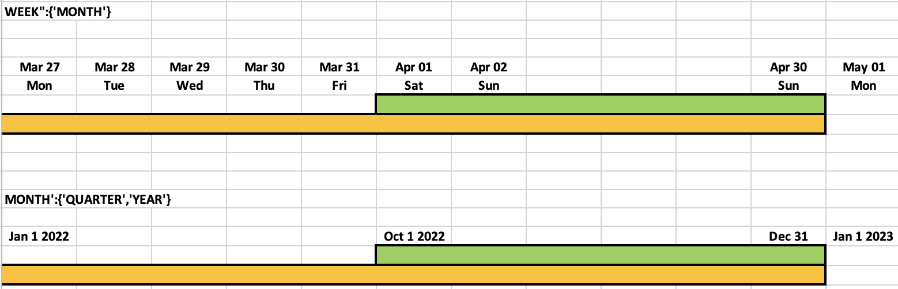

# GAB - Gold Asset Builder

GAB stands for Gold Asset Builder and, technically, it is a SQL-first transformation workflow that allows teams to quickly and collaboratively deploy aggregate tables on top of base fact tables, which can then be used for empowering analytics over different perspectives on dashboards or exploratory queries.

GAB provides the following benefits:

- **Efficiency and speed**: It reduces the efforts and time to production for new aggregate tables (gold layer assets).
- **Simple operation**: It simplifies the cluster decision by having just 3 cluster types (small, medium, large), there's no need to create a separated pipeline for each case. These cluster types are tied to the concept of workload priority in GAB (more on that later).
- **Low-code first:** Focus on low-code aggregation configuration with capabilities to also orchestrate complex SQL.

!!! warning
    Before deciding whether your use case can be supported by GAB or not, read the instructions in the sections below carefully. If there is any doubt about certain metrics which might deviate from the realm of GAB, reach out to us before starting your development and we will support you. GAB may not be a one size fit for all your requirements, so use GAB only if it satisfies your requirements.


## Main Advantages over Self-Orchestrated SQL

- More flexibility to define any type of complex sql queries.
- Only need to touch SQL, GAB takes care of all its orchestration.
- Quick production rollout, adaptability and maintainability, without the need to define any complex aggregation orchestration, rerun logic, monitoring, etc.
- Inner-sourcing model really works, as a data analyst can work on a SQL template and hand it over to the data engineering team, which can then adapt that SQL template and take it to production quickly after the data validation.
- As shown in the image below, it's possible to generate different perspectives (dimensions - D1, D2, D3...) of different metrics (M1, M2, M3) for a specific use case:
    1. **Grouping Set (dimensions D1, D2)** - Compute the same metrics at a higher grain from the finest grain.
    2. **Grouping Set (dimensions D1, D2, D3)** - Compute the same metrics at the finest grain.
    3. **Grouping Set (dimensions D1)** - Compute the same metrics at a higher grain.

    | D1                | D2     | D3     | M1     | M2     | M3     |
    | :------           | :-----:| :-----:| :-----:| :-----:| :-----:|
    | value 1           | value 2| NULL   | 22     | 45     | 54     |
    | value 1           | value 2| value 3| 89     | 12     | 47     |
    | value 1           | NULL   | NULL   | 45     | 57     | 12     |

## When to use GAB?

- When an aggregate result, constructed using SQL, is to be created for different levels of detail (AKA different grains) supporting analytics on dashboards or exploratory queries with some specific dimensions and metrics.
- When metrics and dimensions are bound to configured *DAY, WEEK, MONTH, QUARTER, YEAR* cadences and you are not calculating the whole universe of data in your SQL query (e.g., you're looking back or forward on a specific time interval).

## When not to use GAB?

- When metrics and dimensions are not bound to *DAY, WEEK, MONTH, QUARTER, YEAR* cadences.
- When your result is not an aggregated result, i.e., the resulting table is at the transaction grain.
- If your start and end dates for the time interval include dates into the future.
  - !!! warning
        This is for now a current limitation in the GAB engine codebase (`if new_end_date >= current_date: new_end_date = current_date`) that would require further testing to ensure it can be relaxed.
- If your metrics are not calculated incrementally, you should consider the tradeoff of using GAB vs just writing a very simple "full load" SQL code that computes the all universe of data all the time. 
  - !!! note
        However, if the computation is not very intensive, the orchestration/automation that comes with GAB out of the box can actually provide you value. Moreover, even if the metrics are not computed incrementally, you can collect all the automation benefits from GAB and use a time filter in your SQL statements in GAB. You can take that into consideration for your use case.

## GAB Concepts and Features

### Cadence

In which time grain you want the data to be aggregated: DAILY, WEEKLY, MONTHLY, QUARTERLY, YEARLY. The internal dynamics with the CADENCE concept in GAB heavily rely on an automatically generated dimension calendar for GAB's internal usage.

```python
{'DAY':{},'WEEK':{},'MONTH':{},'YEAR':{}}
```

### Dimensions & Metrics

#### Dimensions

It's just a regular dimension according to the OLAP concept. It will be used to aggregate the metrics, example: `product_category`. Usually it is directly mapped from the source tables without any transformation.

#### Metrics

Aggregated value at the dimension level. As part of the dimensions, GAB has an automatically generated calendar dimension at different grains (more on that below).

There are some options to compute a metric:

- **Using SQL to directly** query and aggregate a source table column. Example: `sum(product_amount)`
- Compute it in the same cadence, but in **CADENCE - 1 time window**. Example: In a `MONTHLY` cadence it will compute for the previous month.
- Compute it in the same cadence, but using **last year's reference value**.  Example: In a `QUARTERLY` cadence it will compute it in the same quarter but from the previous year.
- Compute it in the same cadence, but with a **custom window function**. Example: In a `QUARTER` cadence computing the last 2 quarters.
- Compute it in **using any SQL function**, using any of the available columns, deriving a metric from another, etc. Example: compute a metric by multiplying it by 0.56 for the last 6 months of data.

!!! note
    Each computation derives a [new column on the output view](step_by_step/step_by_step.md#use-case-configuration-using-the-query_builder_helper).

### Extended Window Calculator, Reconciliation & Snapshotting

#### Extended Window Calculator

This feature aims to calculate the extended window of any cadence despite the user providing custom dates which are not the exact start and end dates of a cadence.

For example, if the user wants to calculate the `MONTH` cadence but gives a date range of `2023-01-10` to `2023-01-29`, which is not exactly the start and/or end of the month, the computation window will be extended/adjusted to `2023-01-01`-`2023-01-31`, i.e., including the complete month. This ensures that GAB automatically handles any user error to efficiently integrate the complete data of the selected cadence.

#### Reconciliation

The concept of Extended Window Calculator is intertwined with the concept of Reconciliation. These enable the user to compute the data aggregated by the specified cadence, but leveraging 1) *"cadence to date"* calculations; or 2) Reconcile the data taking into account late events.

##### "*Cadence to Date*" Calculations

For example, there can be a use case where the cadence is `WEEKLY`, but we want the aggregated data with a `DAILY` frequency, so configuring the reconciliation window to be `DAILY` it will compute the data in `WEEK TO DATE` basis. In a case where the first day of week is Monday, on Monday it will have the data just for Monday; on Tuesday will be the computation of Monday + Tuesday; on Wednesday will have the results for Monday + Tuesday + Wednesday; and so on, until the end of week. That example would be configured as follows:

```python
{'WEEK': {'recon_window': {'DAY'}}}
```

##### Reconcile the Data to Account for Late Events

Another example can be if we consider WEEK cadence with reconciliation MONTH and QUARTER enabled (`{WEEK':{'recon_window':['MONTH','QUARTER']}`). What this means is, at the start of a new month or a quarter, all the weeks that still belong to that month or that quarter are recalculated to consider the late events. For example, `2023-01-01` is the start of a month, quarter and a year. In this example, since month and quarter are given, and quarter is the higher grain among the two, all the weeks in Q4/22 (using the extended window explained above) are recalculated, i.e. instead of `2022-10-01` to `2022-12-31`, extended window to consider in the current GAB execution is `2022-09-26` to `2023-01-01`. This is true because the first day of Q1/23 was on a Sunday of the last week of Q4/22, and once we execute GAB on 01/01/2023, we are reconciling all the weeks of Q4/22, hence weekly cadence with quarterly reconciliation.

You can find in the image below other illustrative examples of how the extended window and the reconciliation concept work together. In the first example, GAB will always extend the processing window and reconcile the results for all the weeks (yellow color) involved in that month (green color color). In the second example, GAB will always extend the processing window and reconcile the results for all the months (yellow color) involved in the year (note that green color is quarter, not year, but since year is an higher grain than quarter GAB extends the window and reconciles the results for all the months involved in the year, not only the quarter).



### Snapshot

It creates a snapshot of the data on a specified cadence. For example: in a case where we have `MONTHLY` cadence and snapshot enabled at `DAILY` basis, we are going to compute the aggregates for each day in the month:

```python
{'MONTH': {'recon_window': {'DAY': {'snapshot': 'Y'}}}}
```

This is possible with the template column `{{ to_date }}`, which will tell us the end date of the snapshot.

In the version without snapshot, there will be one record for the *MONTH* cadence, but when we enable the above configuration the number of entries for the *MONTH* cadence will be the same as the number of days in the month.

This means there will be a separate entry for each day of the month, which enables to compare the data to the previous year on the same day from the start of the month.

!!! note
    The snapshot feature will always write the snapshot entry for the given period (start date and end date), meaning if you have runs that overlap each other but for a different period (e.g., same start date but different end date) it will not rewrite past snapshot entries.

The above configuration is just an example, and the snapshot can be enabled on any combination of cadences:

```python
{'QUARTER': {'recon_window': {'WEEK': {'snapshot': 'Y'}}}}
{'YEAR': {'recon_window': {'MONTH': {'snapshot': 'Y'}}}}
{'MONTH': {'recon_window': {'WEEK': {'snapshot': 'Y'}}}}
```

## Next Steps

If you are interested in using GAB you can check our [step-by-step documentation](step_by_step/step_by_step.md) that aims to help in the use case configuration and make easier to use GAB.

## FAQ

### Can we ensure past snapshots are not changed?

When we use the snapshots feature, taking monthly cadence with daily reconciliation as example, the number of entries for the *MONTH* cadence will be the same as the number of days in the month, because every day, GAB will generate a snapshot of that month, providing a cumulative picture of the month throughout the several days. In this way, snapshots are immutable.

There may be cases, where the date that you want to control the snapshots is different than the cadence date in GAB, and in this case you will have to inject custom snapshot gathering logic in your GAB SQL templates and potentially play around with GAB's filter date to achieve what you want, because as of now, GAB relies on the cadence date to control the snapshot logic.

### How exactly `lookback_window` works?

Sometimes, `lookback_days` in [GAB execution notebook](../../assets/gab/notebooks/gab.py) and `lookback_window` get confused. `lookback_window` is only used for when you define derived metrics that use window functions (check [step-by-step documentation](step_by_step/step_by_step.md)), and it is used to configure the window. On the other hand, `lookback_days` are only part of [GAB execution notebook](../../assets/gab/notebooks/gab.py) to modify the provided `start_date` so that it considers `lookback_days` before that.

### Can I use GAB with cadence dates in the future?

As mentioned in the ["When not to use GAB?"](#when-not-to-use-gab) section, this is currently not supported.

### What is the purpose of the `rerun` flag?

If you run GAB for same start date and end date as it was run before, without the *rerun* flag, GAB will ignore the execution based on the `gab_events_log` table. The *rerun* flag ensures we can force such re-execution.

### Does my data product needs to be using a star schema (fact table and dimension tables) to use GAB?

No, GAB can be used regardless of the underlying data model, as you should prepare your data with templated SQL (that can be as simple or as complex as your use case) before feeding it to the GAB execution engine.
