# GAB step-by-step

## 1. Data Product Setup based on templated files
- Lakehouse engine: 1.20.0+
- Copy GAB assets from templated files to your data product:
  - GAB tables:
      - [Calendar table - dim_calendar](../../../assets/gab/metadata/tables/dim_calendar.sql)
      - [Use case configuration table - lkp_query_builder](../../../assets/gab/metadata/tables/lkp_query_builder.sql)
      - [Unified data table - gab_use_case_results](../../../assets/gab/metadata/tables/gab_use_case_results.sql)
      - [GAB log events table - gab_log_events](../../../assets/gab/metadata/tables/gab_log_events.sql)
  - GAB notebooks:
      - [Feed Calendar table - gab_dim_calendar](../../../assets/gab/notebooks/gab_dim_calendar.py)
      - [Use case creation - query_builder_helper](../../../assets/gab/notebooks/query_builder_helper.py)
      - [GAB execution - gab](../../../assets/gab/notebooks/gab.py)
      - [GAB job manager - gab_job_manager](../../../assets/gab/notebooks/gab_job_manager.py)

## 2. Use case setup
### Templating SQL Query
**The placeholder will always use [pre-configured values from the use case](#use-case-configuration-using-the-query_builder_helper) (lkp_query_builder).** 

#### Available Placeholders:
- Date Aggregation:
    - Reference date (the date column used to compute the cadences and the extended window)
  ```python
   {{ project_date_column }}
   ({{ project_date_column }} + interval '{{offset_value}}' hour)
  
  ```
  **Note:** The `replace_offset_value` have the responsibility to use directly the date column or shift it to the specified timezone using the `offset_value` from the configured use case.
    - Last day of the cadence and if snapshots are enabled then it contains the snapshot end day:
  ```python
  {{ to_date }}
  ```
- Filter:
    - It expects to have the data partitioned by date (year/month/day) and it replaces the placeholder with a filter like `year = **** and month = ** and day = **`:
  ```python
  {{ partition_filter }}
  ```
  **Note:** if your table does not have the Year, Month, Day columns you should not add this template
    - Shift the data consumed on your use case to be between the specified offset timezone:
  ```python
  {{ filter_date_column }} >= ('{{ start_date }}' + interval '{{offset_value}}' hour) AND {{ filter_date_column }} < ('{{ end_date}}' + interval '{{offset_value}}' hour)
  ```
- The source database to consume the data:
  ```python
  {{ database }}
  ```
- Calendar join:
  ```python
  {{ joins }}
  ```
  **Note:** Can be added after any of the table names in the `from` statement. The framework renders this `joins` with an internal calendar join and populates the `to_date` and the `project_date_column` as per the configured cadences, which means, **it will need to be added** when using **Cadence**, **Extended Window Calculation**, **Reconciliation** and **Snapshot**.

#### Sample combined query making use of the placeholders:
```python
SELECT
     {{ project_date_column }}  ({{ project_date_column }} + interval '{{offset_value}}' hour)  AS order_date,  # date aggregation: computed cadence start date
    {{ to_date }} AS to_date,  # date aggregation: last day of the cadence or of the snapshot if enabled
    b.category_name,
    COUNT(a.article_id) qty_articles,
    SUM(amount) total_amount
FROM
    {{ database }}.dummy_sales_kpi a  # source database
    {{ joins }}  # calendar table join: used to compute the cadence start and end date
LEFT JOIN
    article_categories b ON a.article_id = b.article_id
WHERE
    {{ partition_filter }}  # filter: partition filter
AND
    TO_DATE({{ filter_date_column }}, 'yyyyMMdd') >= (
        '{{ start_date }}' + interval '{{ offset_value }}' hour
    )  # filter by date column configured in the use case for this file and timezone shift
AND
    TO_DATE({{ filter_date_column }}, 'yyyyMMdd') < (
        '{{ end_date }}' + interval '{{ offset_value }}' hour
    )  # filter by date column configured in the use case for this file and timezone shift
GROUP BY 1,2,3
```

**Note:** If there's just one sql file for the use case, the file should start with 1_. When the use case has several different intermediate stages/temp tables, please create them according to the sequence order, as shown in the screenshot, and a final combined script, example:

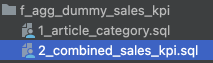

We suggest using the folder **metadata/gab** to use as the SQL use case folder but this is a parametrised property which you can override with the property [gab_base_path](../../../assets/gab/notebooks/gab.py). This property is used in the [job manager as well](../../../assets/gab/notebooks/gab_job_manager.py).

### Use case configuration using the **query_builder_helper**
??? example "1. General configuration"
    GAB will pull information from **`lkp_query_builder`** in order to retrieve information/configuration to execute the process. To help us on this task a [query_builder_help notebook was provided](../../../assets/gab/notebooks/query_builder_helper.py). We will follow the notebook instructions to add necessary configuration.
      
    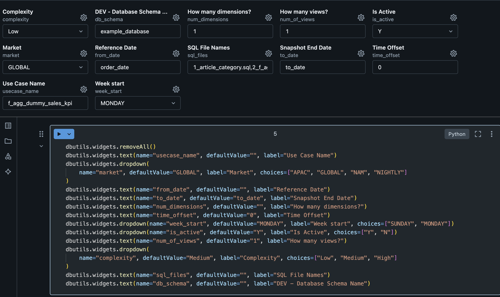
      
    | Variable                    | Value                                                    | Description                                                                                                                                                                                                                                                                                                                                                                                                                                                    |
    |-----------------------------|----------------------------------------------------------|----------------------------------------------------------------------------------------------------------------------------------------------------------------------------------------------------------------------------------------------------------------------------------------------------------------------------------------------------------------------------------------------------------------------------------------------------------------|
    | **Complexity**              | Low                                                      | Defines the complexity of your use case.<br />You should mainly consider the volume of data.<br />Possible values: **Low**, **Medium** and **High**.                                                                                                                                                                                                                                                                                                           |
    | **Database Name**           | example_database                                         | Refers to the name of the development environment database where the **lkp_query_builder** table resides.<br />This parameter is used at the end of the notebook to insert data into the **lkp_query_builder** table.                                                                                                                                                                                                                                          |
    | **How many dimensions**     | 1                                                        | Number of dimensions (columns) expected in the use case.<br />**Note: Do not consider the reference date or metrics here, as they have their own parameters.**                                                                                                                                                                                                                                                                                                 |
    | **How many views**          | 1                                                        | Defines how many views to generate in the use case, it's possible to have as many as the use case need.<br />All views will have the same structure (dimensions and metrics), the only difference possible to specify between the views is the **view filter**.<br />**Default value is 1.**<br />**Note**: This configuration have a direct impact in the `3. Configure View Name and Filters` configuration.                                                 |
    | **Is Active**               | Y                                                        | Flag to make the use case active or not.<br />**Default value is Y**.                                                                                                                                                                                                                                                                                                                                                                                          |
    | **Market**                  | GLOBAL                                                   | Used in the **gab_job_manager** to execute the use cases for each **market**.                                                                                                                                                                                                                                                                                                                                                                                  |
    | **SQL File Names**          | 1_article_category.sql,<br />2_f_agg_dummy_sales_kpi.sql | Name of the SQL files used in the use case. <br />You can combine different layers of dependencies between them as shown in the example, where the **2_combined.sql** file depends on **1_product_category.sql** file. <br />The file name should follow the pattern x_file_name (where x is an integer digit) and be separated by a comma (e.g.: 1_first_query.sql, 2_second_query.sql).                                                                      |
    | **Snapshot End Date**       | to_date                                                  | This parameter is used in the template, by default its value must be ***to_date***.<br />You can change it if you have managed this in your SQL files.<br />The values stored in this column depend on the use case behavior:<br /><ul><li>if snapshots are enabled, it will contain the snapshot end day.</li><li>If no snapshot is enabled, it will contain the last day of the cadence.</li></ul>The snapshot behaviour is set in the reconciliation steps. |
    | **Timezone Offset**         | 0                                                        | The time zone offset that you want to apply to the reference date column.<br />It should be a number to decrement or add to the date (e.g., -8 or 8).<br />**The default value is zero**, which means that any time zone transformation will be applied to the date.                                                                                                                                                                                           |
    | **Use Case Name**           | f_agg_dummy_sales_kpi                                    | Name of the use case.<br />The suggestion is to use lowercase and underlined alphanumeric characters.                                                                                                                                                                                                                                                                                                                                                          |
    | **Use Case Reference Date** | order_date                                               | Reference date of the use case.<br /The parameter should be the column name and the selected column should have the date/datetime format.                                                                                                                                                                                                                                                                                                                      |
    | **Week Start**              | MONDAY                                                   | The start of the business week of the use case.<br />Possible values: **SUNDAY** or **MONDAY**.                                                                                                                                             
??? example "2. Configure Dimension Names"
    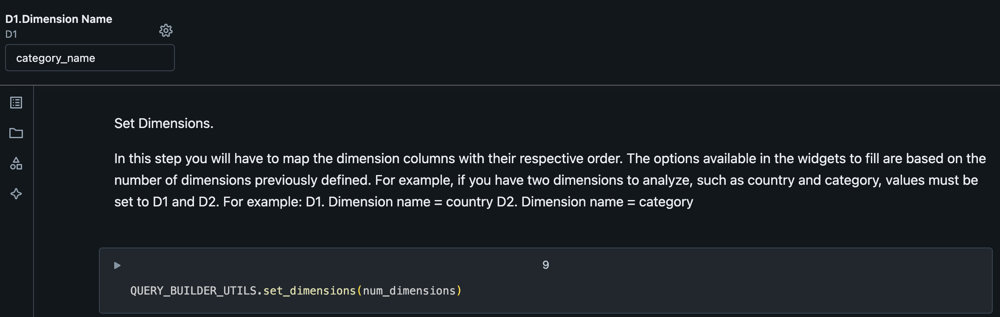

??? example "3. Configure View Name and Filters"
    This will be the name of the view at the end of the process. Filters should be applied at this step if needed.
    
    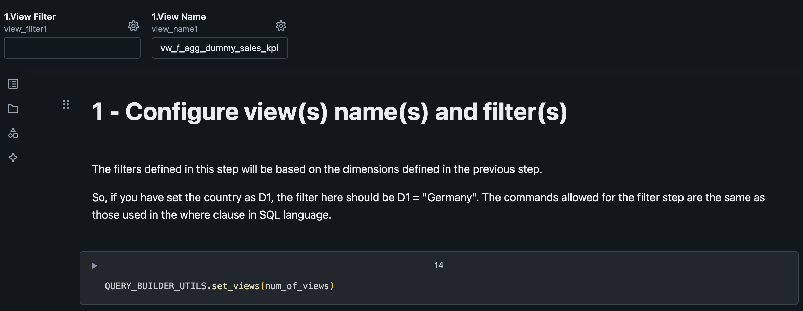
    
    | Variable        | Value                    | Description                                                                                                                                                                                                                                                             |
    |-----------------|--------------------------|-------------------------------------------------------------------------------------------------------------------------------------------------------------------------------------------------------------------------------------------------------------------------|
    | **View Filter** |                          | Based on the dimensions defined in the previous step.<br />**Example**: if you have set the country as `D1`, the filter here could be **D1 = "Germany"**. The commands allowed for the filter step are the same as those supported in the where clause in SQL language. |
    | **View Name**   | vw_f_agg_dummy_sales_kpi | Name of the view to output the computed data.                                                                                                                                                                                                                           |
??? example "4. Configure RECON"
    This step is where we define which will be the cadence displayed at the view.
    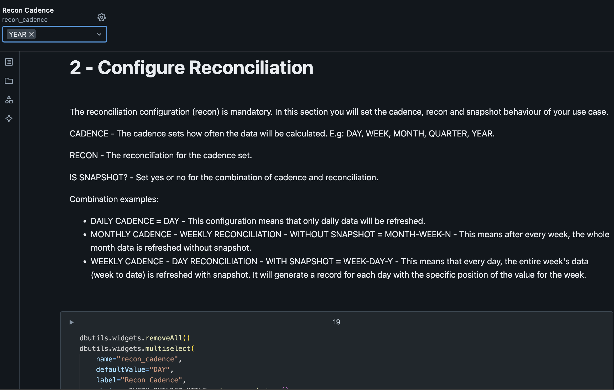
    
    | Variable                   | Value | Description                                                                                                                                             |
    |----------------------------|-------|---------------------------------------------------------------------------------------------------------------------------------------------------------|
    | **Reconciliation Cadence** | YEAR  | Compute the data aggregated by the specified cadence but with the reconciliation frequency.<br />[Check more about it here](../gab.md#reconciliation) |

??? example "5. Configure METRICS"
    First question regarding metrics is how many metrics do we have on our SQL use case query.
    
    On our template we have two metrics (`qty_articles` and `total_amount`).
    
    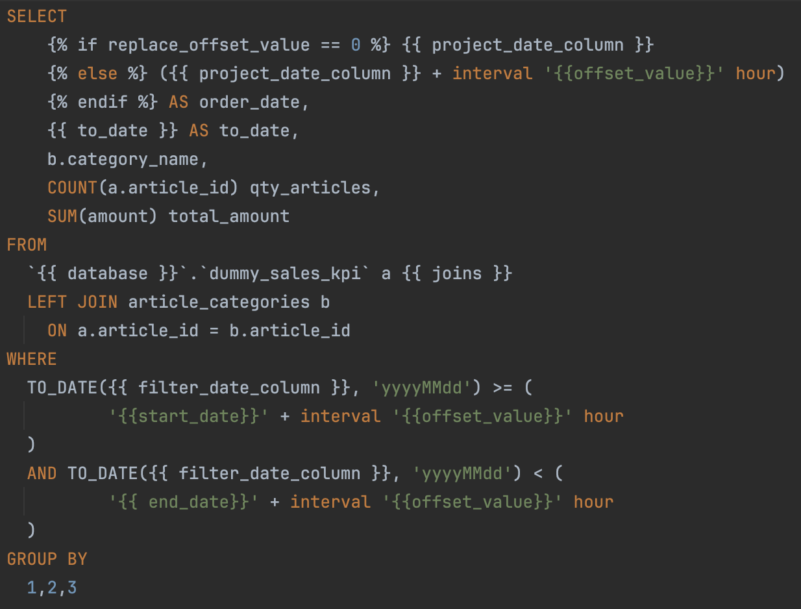
    
    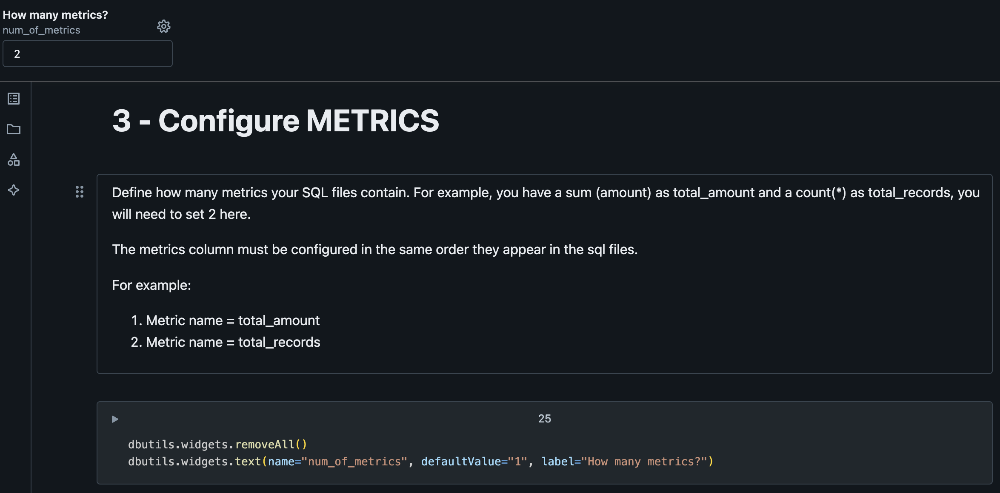
    
    The next paragraph will create widgets for us to be able to define if we want GAB to create secondary calculations for us based on the metric name. **Note: metrics should follow the same order as defined on the SQL use case query.**
    
    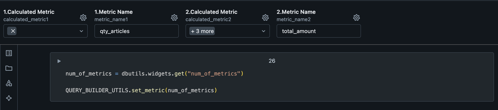
    
    | Variable                                    | Description                                                                                                                                                                                                                                                                                                                                                                      |
    |---------------------------------------------|----------------------------------------------------------------------------------------------------------------------------------------------------------------------------------------------------------------------------------------------------------------------------------------------------------------------------------------------------------------------------------|
    | [**Calculated Metric**](../gab.md#metric) | It's possible to derive (add secondary calculations) 4 new columns based on each metric.<br />Those new columns will be based on cadences like ***last_cadence***, ***last_year_cadence*** and ***window function***.<br />But also, you can create a derived column,<br />which is a SQL statement that you can write on your own by selecting the ***derived_metric*** option. |
    | **Metric Name**                             | Name of the base metric. Should have the same name as on the SQL use case query.                                                                                                                                                                                                                                                                                                 |
    
    
    The next metrics configuration is where we configure secondary calculations.
    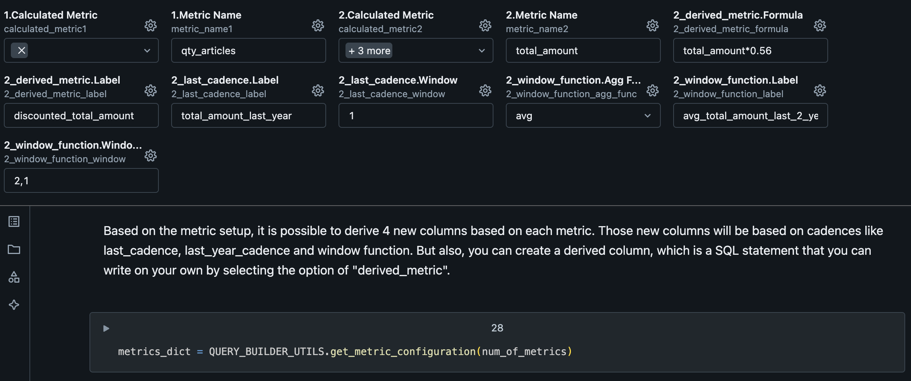
    
    | Variable                            | Description                                                                                                                                |
    |-------------------------------------|--------------------------------------------------------------------------------------------------------------------------------------------|
    | **derived_metric.Formula**          | Formula to calculate the metric referring any of previous configured metrics by the **Metric Name**.<br />**Example**: `total_amount*0.56` |
    | **derived_metric.Label**            | Name of the generated metric by ***derived_metric***.                                                                                      |
    | **last_cadence.Label**              | Name of the generated metric by ***last_cadence***.                                                                                        |
    | **last_cadence.Window**             | Cadence lookback window, which means in this example,<br />a lookback from the previous year (as the use case is on **YEARLY** cadence)    |
    | **window_function.Agg Func**        | SQL Function to calculate the metric.<br />Possible values: ***sum***, ***avg***, ***max***, ***min***, ***count***                        |
    | **window_function.Label**           | Name of the generated metric by ***window_function***.                                                                                     |
    | **window_function.Window Interval** | Window interval to use on the metric generation. 

??? example "6. Configure Stages"
    Stages are related to each SQL statement at the use case.
    
    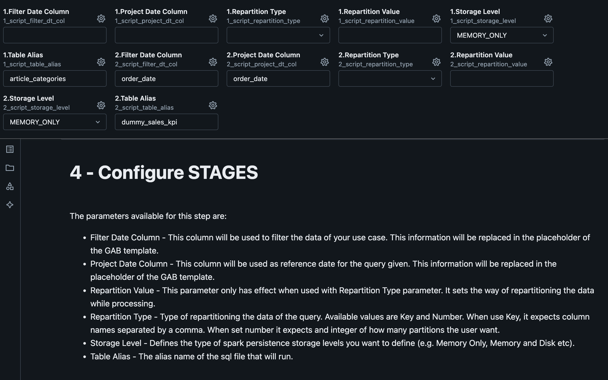
    
    | Variable                       | Description                                                                                                                                                                                                                                       |
    |--------------------------------|---------------------------------------------------------------------------------------------------------------------------------------------------------------------------------------------------------------------------------------------------|
    | **Script Filter Date Column**  | It will be used to filter the data of your use case.<br />This information will be replaced in the placeholder of the GAB template.                                                                                                               |
    | **Script Project Date Column** | It will be used as reference date for the query given.<br />This information will be replaced in the placeholder of the GAB template.                                                                                                             |
    | **Script Repartition Type**    | Type of repartitioning the data of the query.<br />Possible values: ***Key*** and ***Number***.<br />When use Key, it expects column names separated by a comma.<br />When use number it expects an integer of how many partitions the user want. |
    | **Script Repartition Value**   | This parameter only has effect when used **with Repartition Type parameter**.<br />It sets the way of repartitioning the data while processing.                                                                                                   |
    | **Script Storage Level**       | Defines the type of spark persistence storage levels you want to define<br />(e.g. ***Memory Only***, ***Memory and Disk*** etc).                                                                                                                 |
    | **Script Table Alias**         | The alias name of the sql file that will run, this name can be used to <br />consume the output of the execution in the next stage(next sql file). 

??? example "7. Build and Insert SQL Instruction"
    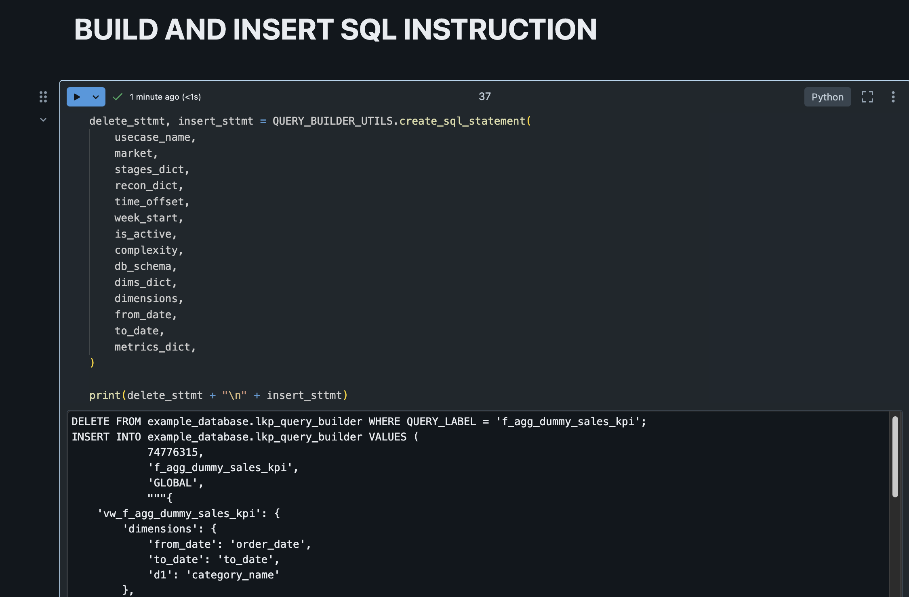
    
    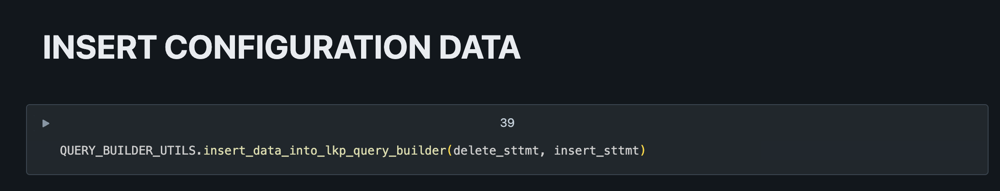
    
    At the end of the process it should have data inserted on lkp_query_builder table:
    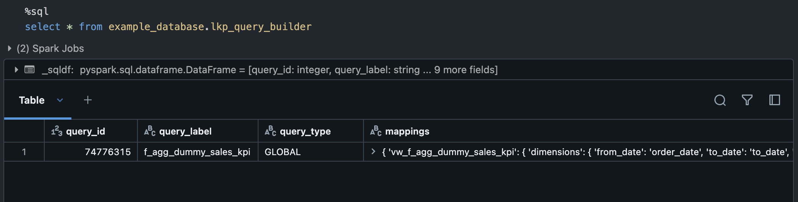

??? example "Configured Use case"
    After configuring the use case, it would generate a SQL command to create it on the `lkp_query_builder`, like this:
    ```sql
    DELETE FROM example_database.lkp_query_builder WHERE QUERY_LABEL = 'f_agg_dummy_sales_kpi';
    INSERT INTO example_database.lkp_query_builder VALUES (
      1,
      'f_agg_dummy_sales_kpi',
      'GLOBAL',
      """{
        'vw_f_agg_dummy_sales_kpi': {
          'dimensions': {
            'from_date': 'order_date',
            'to_date': 'to_date',
            'd1': 'category_name'
          },
          'metric': {
            'm1': {
              'metric_name': 'qty_articles',
              'calculated_metric': {},
              'derived_metric': {}
            },
            'm2': {
              'metric_name': 'total_amount',
                'calculated_metric': {
                  'last_cadence': [
                    {
                      'label': 'total_amount_last_year',
                      'window': '1'
                    }
                  ],
                  'window_function': [
                    {
                      'label': 'avg_total_amount_last_2_years',
                      'window': [2, 1],
                      'agg_func': 'avg'
                    }
                  ]
                },
                'derived_metric': [
                  {
                    'label': 'discounted_total_amount',
                    'formula': 'total_amount*0.56'
                  }
                ]
              }
            },
          'filter': {}
        }
      }""",
      """{
        '1': {
            'file_path': 'f_agg_dummy_sales_kpi/1_article_category.sql',
            'table_alias': 'article_categories',
            'storage_level': 'MEMORY_ONLY',
            'project_date_column': '',
            'filter_date_column': '',
            'repartition': {}
        },
        '2': {
            'file_path': 'f_agg_dummy_sales_kpi/2_f_agg_dummy_sales_kpi.sql',
            'table_alias': 'dummy_sales_kpi',
            'storage_level': 'MEMORY_ONLY',
            'project_date_column': 'order_date',
            'filter_date_column': 'order_date',
            'repartition': {}
        }
      }""",
      """{'YEAR': {}}""",
      '0',
      'MONDAY',
      'Y',
      'Low',
      current_timestamp()
    );
    ```

## 3. Use case execution
After the initial setup and adding your use case to the ***lkp_query_builder*** you can schedule the [gab_job_manager](../../../assets/gab/notebooks/gab_job_manager.py) to manage the use case execution in any schedule time you want.

## 4. Consuming the data
The data is available in the view you specified as output from the use-case, so you can normally consume the view as you would consume any other data (directly on power bi or in another pipeline).
