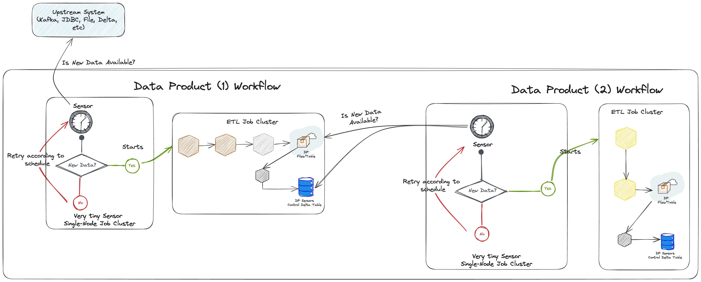

# Sensor

## What is it?

The lakehouse engine sensors are an abstraction to otherwise complex spark code that can be executed in very small
single-node clusters to check if an upstream system or data product contains new data since the last execution of our
job. With this feature, we can trigger a job to run in more frequent intervals and if the upstream does not contain new
data, then the rest of the job exits without creating bigger clusters to execute more intensive data ETL (Extraction,
Transformation, and Loading).

## How do Sensor-based jobs work?

With the sensors capability, data products in the lakehouse can sense if another data product or an upstream system (source
system) have new data since the last successful job. We accomplish this through the approach illustrated above, which
can be interpreted as follows:

1. A Data Product can check if Kafka, JDBC or any other Lakehouse Engine Sensors supported sources, contains new data using the respective sensors;
2. The Sensor task may run in a very tiny single-node cluster to ensure cost
   efficiency ([check sensor cost efficiency](#are-sensor-based-jobs-cost-efficient));
3. If the sensor has recognised that there is new data in the upstream, then you can start a different ETL Job Cluster
   to process all the ETL tasks (data processing tasks).
4. In the same way, a different Data Product can sense if an upstream Data Product has new data by using 1 of 2 options:
    1. **(Preferred)** Sense the upstream Data Product sensor control delta table;
    2. Sense the upstream Data Product data files in s3 (files sensor) or any of their delta tables (delta table
       sensor);

## The Structure and Relevance of the Data Product’s Sensors Control Table

The concept of a lakehouse engine sensor is based on a special delta table stored inside the data product that chooses
to opt in for a sensor-based job. That table is used to control the status of the various sensors implemented by that
data product. You can refer to the below table to understand the sensor delta table structure:

| Column Name                 | Type           | Description                                                                                                                                                                                                                                                                                                                                                                                                                                                                                                                                                                                            |
|-----------------------------|----------------|--------------------------------------------------------------------------------------------------------------------------------------------------------------------------------------------------------------------------------------------------------------------------------------------------------------------------------------------------------------------------------------------------------------------------------------------------------------------------------------------------------------------------------------------------------------------------------------------------------|
| **sensor_id**               | STRING         | A unique identifier of the sensor in a specific job. This unique identifier is really important because it is used by the engine to identify if there is new data in the upstream. Each sensor in each job should have a different sensor_id. If you attempt to create 2 sensors with the same sensor_id, the engine will fail.                                                                                                                                                                                                                                                              |
| **assets**                  | ARRAY\<STRING> | A list of assets (e.g., tables or dataset folder) that are considered as available to consume downstream after the sensor has status *PROCESSED_NEW_DATA*.                                                                                                                                                                                                                                                                                                                                                                                                                                             |
| **status**                  | STRING         | Status of the sensor. Can either be: <ul><li>*ACQUIRED_NEW_DATA* – when the sensor in a job has recognised that there is new data from the upstream but, the job where the sensor is, was still not successfully executed.</li><li>*PROCESSED_NEW_DATA* - when the job where the sensor is located has processed all the tasks in that job.</li></ul>                                                                                                                                                                                                                                             |
| **status_change_timestamp** | STRING         | Timestamp when the status has changed for the last time.                                                                                                                                                                                                                                                                                                                                                                                                                                                                                                                                               |
| **checkpoint_location**     | STRING         | Base location of the Spark streaming checkpoint location, when applicable (i.e., when the type of sensor uses Spark streaming checkpoints to identify if the upstream has new data). E.g. Spark streaming checkpoints are used for Kafka, Delta and File sensors.                                                                                                                                                                                                                                                                                                                                      |
| **upstream_key**            | STRING         | Upstream key (e.g., used to store an attribute name from the upstream so that new data can be detected automatically). This is useful for sensors that do not rely on Spark streaming checkpoints, like the JDBC sensor, as it stores the name of a field in the JDBC upstream that contains the values that will allow us to identify new data (e.g., a timestamp in the upstream that tells us when the record was loaded into the database).                                                                                                                                                   |
| **upstream_value**          | STRING         | Upstream value (e.g., used to store the max attribute value from the upstream so that new data can be detected automatically). This is the value for upstream_key.  This is useful for sensors that do not rely on Spark streaming checkpoints, like the JDBC sensor, as it stores the value of a field in the JDBC upstream that contains the maximum value that was processed by the sensor, and therefore useful for recognizing that there is new data in the upstream (e.g., the value of a timestamp attribute in the upstream that tells us when the record was loaded into the database). |

!!! note
    To make use of the sensors you will need to add this table to your data product.

## How is it different from scheduled jobs?

Sensor-based jobs are still scheduled, but they can be scheduled with higher frequency, as they are more cost-efficient
than ramping up a multi-node cluster supposed to do heavy ETL, only to figure out that the upstream does not have new
data.

## Are sensor-based jobs cost-efficient?

For the same schedule (e.g., 4 times a day), sensor-based jobs are more cost-efficient than scheduling a regular job, because with sensor-based jobs you can start a **very tiny single-node cluster**, and only if there is new data in the upstream the bigger ETL cluster is spin up. For this reason, they are considered more cost-efficient.
Moreover, if you have very hard SLAs to comply with, you can also play with alternative architectures where you can have several sensors in a continuous (always running) cluster, which then keeps triggering the respective data processing jobs, whenever there is new data.

## Sensor Steps

1. Create your sensor task for the upstream source. Examples of available sources:
    - [Delta Table](delta_table/delta_table.md)
    - [Delta Upstream Sensor Table](delta_upstream_sensor_table/delta_upstream_sensor_table.md)
    - [File](file/file.md)
    - [JDBC](jdbc_table/jdbc_table.md)
    - [Kafka](kafka/kafka.md)
    - [SAP BW/B4](sap_bw_b4/sap_bw_b4.md)
2. Setup/Execute your ETL task based in the Sensor Condition
3. Update the Sensor Control table status with the [Update Sensor Status](update_sensor_status/update_sensor_status.md)