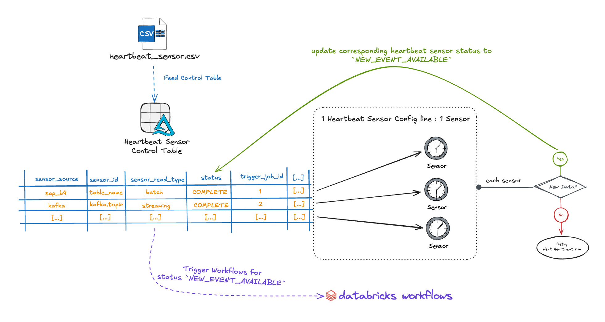
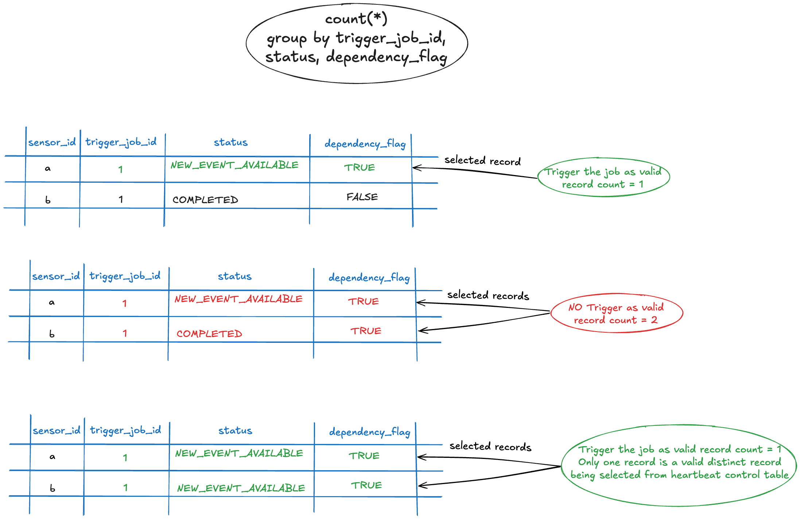

# Heartbeat Sensor

## What is it?

The Heartbeat Sensor is a robust, configurable system designed to continuously monitor 
upstream systems for new data. It enhances the existing sensor infrastructure by addressing 
key limitations and providing significant improvements:

**Previous Sensor Architecture Limitations:**

- Required individual sensor configurations for each data source.
- Limited scalability when monitoring multiple upstream systems.
- Manual job triggering and dependency management.
- No centralized control or monitoring of sensor status.
- Difficult to manage complex multi-source dependencies.

**Heartbeat Sensor Enhancements:**

- **Centralized Management**: Single control table to manage all sensor sources and their dependencies.
- **Automated Job Orchestration**: Automatically triggers downstream Databricks jobs when new data is detected.
- **Multi-Source Support**: Handles diverse source types (SAP, Kafka, Delta Tables, Manual Uploads, Trigger Files) in one unified system.
- **Dependency Management**: Built-in hard/soft dependency validation before triggering jobs.
- **Scalable Architecture**: Efficiently processes multiple sensors in parallel.
- **Status Tracking**: Comprehensive lifecycle tracking from detection to job completion.

This provides a centralized, efficient, and automated mechanism to detect and trigger 
downstream workflows with minimal user intervention.

## How Does the Heartbeat Sensor Work?



The Heartbeat Sensor operates on a pull-based approach using a single-node cluster that continuously monitors upstream systems. Here's how the system works:

### Core Architecture Components

**1. [Centralized Control Table](#control-table-schema)**

- Tracks and manages all data sources and their configurations.
- Dynamically populated by the [Heartbeat Data Feeder Job](heartbeat_sensor_data_feed/heartbeat_sensor_data_feed.md).
- Provides structured monitoring across various upstream systems.

**2. Persistent Heartbeat Job**

- Runs continuously or on a user-defined schedule.
- Supports both real-time and batch-style data monitoring.
- Efficiently processes multiple sensors in parallel.

**3. Sensor Integration Framework**

- Leverages existing sensor mechanisms for event detection.
- Creates appropriate Sensor ACONs based on source types.
- Returns `NEW_EVENT_AVAILABLE` status when new data is detected.

**4. Automated Job Orchestration**

- Triggers Databricks jobs via Job Run API when conditions are met.
- Validates dependencies before job execution.
- Maintains comprehensive audit trail of all operations.

### Operational Flow

1. **Continuous Monitoring**: The heartbeat cluster continuously polls configured sensor sources.
2. **Event Detection**: Checks each source for `NEW_EVENT_AVAILABLE` status.
3. **Dependency Validation**: Evaluates hard/soft dependencies before triggering jobs.
4. **Automatic Triggering**: Launches Databricks jobs when all conditions are satisfied.
5. **Status Management**: Updates control table throughout the entire lifecycle.

!!! warning "Pull-Based Architecture"
    The system is designed for a "pull" approach, same as the Sensor solution.
    Downstream data product sensor clusters actively check for new events from the
    upstream. Upstream sensor clusters do not require write permissions to the downstream
    data product system. Just read access is required for upstream from downstream system.

### Control Table Schema

The Heartbeat Sensor Control Table is the central component that manages all sensor sources and their configurations. Below is the complete schema with detailed descriptions:

| Column name                        | Data Type | Description                                                                                                                                                                                                                                                                                                                                                                                                                                                                                                                                                                                                                                                                                                                  | Produced/Maintained by |
|------------------------------------|-----------|------------------------------------------------------------------------------------------------------------------------------------------------------------------------------------------------------------------------------------------------------------------------------------------------------------------------------------------------------------------------------------------------------------------------------------------------------------------------------------------------------------------------------------------------------------------------------------------------------------------------------------------------------------------------------------------------------------------------------|------------------------|
| **sensor_source**                  | STRING    | Upstream source system<ul><li>`sap_b4` - SAP 4HANA</li><li>`sap_bw` SAP BW</li><li>`delta_table`</li><li>`lmu_delta_table` - Lakehouse Manual Upload</li><li>`kafka`</li><li>`trigger_file`</li></ul>                                                                                                                                                                                                                                                                                                                                                                                                                                                                                                                        | User/Developer         |
| **sensor_id**                      | STRING    | Unique Upstream id or upstream reference.<ul><li>**sap_bw** or **sap_b4** source:<br />SAP Chain Id, example: `SAP_CHAIN_ID_SAP_TABLE`</li><li>**delta_table** source: Delta table name along with database name, examples: `my_database_1.my_table`; `my_database_2.my_table_2`</li><li>**lmu_delta_table** source: Lakehouse Manual Upload Delta table name along with database name, examples: `my_database.my_lmu_table`</li><li>**kafka** source: Kafka Topic name starting with <data_product_name:> prefix and then the topic name, example: `data_product_name: my_product.my.topic`.</li><li>**trigger_file** source: Asset name/folder name under which trigger file will be kept, example: `my_trigger`</li></ul> | User/Developer         |
| **sensor_read_type**               | STRING    | Sensor read type to fetch new event - can be batch or streaming.                                                                                                                                                                                                                                                                                                                                                                                                                                                                                                                                                                                                                                                             | User/Developer         |
| **asset_description**              | STRING    | Description of Upstream source (It can be upstream name).                                                                                                                                                                                                                                                                                                                                                                                                                                                                                                                                                                                                                                                                    | User/Developer         |
| **upstream_key**                   | STRING    | upstream key (an attribute name from the upstream so that new data can be detected automatically), example: `load_date`.<br />This is useful for sensors that do not rely on Spark streaming checkpoints, like the JDBC sensor, as it stores the name of a field in the JDBC upstream that contains the values that will allow us to identify new data (e.g., a timestamp in the upstream that tells us when the record was loaded into the database).<br />**Note**: This attribute will be used in the `preprocess_query`, example: `SELECT * FROM sensor_new_data WHERE ?upstream_key >= current_date() - 7` will be rendered to `SELECT * FROM sensor_new_data WHERE load_date >= current_date() - 7`                    | User/Developer         |
| **preprocess_query**               | STRING    | Query to filter data returned by the upstream. **Note**: This parameter is only needed when the upstream data have to be filtered, in this case a custom query should be created with the source table as `sensor_new_data`.<br />Example: `SELECT * FROM sensor_new_data WHERE load_date >= current_date() - 7`                                                                                                                                                                                                                                                                                                                                                                                                             | User/Developer         |
| **latest_event_fetched_timestamp** | TIMESTAMP | Latest event fetched timestamp for upstream source. It will be updated each time as soon as NEW EVENT is available.                                                                                                                                                                                                                                                                                                                                                                                                                                                                                                                                                                                                          | lakehouse-engine       |
| **trigger_job_id**                 | STRING    | Databricks Job Id of downstream application. Based on this, Job will get triggered by Heartbeat once new event is available.                                                                                                                                                                                                                                                                                                                                                                                                                                                                                                                                                                                                 | User/Developer         |
| **trigger_job_name**               | STRING    | Databricks Job Name.                                                                                                                                                                                                                                                                                                                                                                                                                                                                                                                                                                                                                                                                                                         | User/Developer         |
| **status**                         | STRING    | Status of the orchestration.<br/><ul><li>`NEW_EVENT_AVAILABLE` once new event is found.</li><li>`IN PROGRESS` - When job gets triggered</li><li>`COMPLETED` - once Job completed successfully</li></ul>                                                                                                                                                                                                                                                                                                                                                                                                                                                                                                                      | lakehouse-engine       |
| **status_change_timestamp**        | STRING    | string containing the datetime when the status has changed.                                                                                                                                                                                                                                                                                                                                                                                                                                                                                                                                                                                                                                                                  | lakehouse-engine       |
| **job_start_timestamp**            | TIMESTAMP | Start timestamp of downstream Job. It will get updated as soon as Job went into `IN_PROGRESS` job_status.                                                                                                                                                                                                                                                                                                                                                                                                                                                                                                                                                                                                                    | lakehouse-engine       |
| **job_end_timestamp**              | TIMESTAMP | End timestamp of downstream Job. It will get updated as soon as Job went into `COMPLETED` job_status.                                                                                                                                                                                                                                                                                                                                                                                                                                                                                                                                                                                                                        | lakehouse-engine       |
| **job_state**                      | STRING    | Current status of Job in Control table. `PAUSED` or `UNPAUSED`. If `PAUSED`, Sensor will **not look** for NEW EVENTS or Trigger the dependent job.                                                                                                                                                                                                                                                                                                                                                                                                                                                                                                                                                                           | User/Developer         |
| **dependency_flag**                | STRING    | <ul><li>TRUE - For Hard dependency</li><li>FALSE - For SOFT dependency</li></ul>All dependent Job needs to complete successfully for HARD dependency. For SOFT → FALSE marked job will be ignored. Default - must be TRUE in case of no dependency.                                                                                                                                                                                                                                                                                                                                                                                                                                                                          | User/Developer         |

### Control Table Reference Records

The following table shows **example records** that demonstrate how different types of sensor sources are configured in the Heartbeat Sensor Control Table. These are **sample entries** that illustrate the structure and typical values for each column across various sensor source types (Kafka, Lakehouse Manual Upload Delta Table, SAP B4, Delta Table, and Trigger File).

**Purpose of these examples:**

- Show real-world configuration patterns for different sensor sources.
- Demonstrate how different statuses (`NEW_EVENT_AVAILABLE`, `IN_PROGRESS`, `null`) appear in the table.
- Illustrate the relationship between sensor sources and their corresponding Databricks jobs.
- Provide reference values for fields like `sensor_id`, `trigger_job_id`, and status timestamps.

!!! note
    These are illustrative examples - your actual table will contain records specific to your data sources and job configurations.

| sensor_source   | sensor_id                    | sensor_read_type | asset_description                      | upstream_key | preprocess_query | latest_event_fetched_timestamp | trigger_job_id | trigger_job_name                         | status              | status_change_timestamp  | job_start_timestamp      | job_end_timestamp | job_state | dependancy_flag |
|-----------------|------------------------------|------------------|----------------------------------------|--------------|------------------|--------------------------------|----------------|------------------------------------------|---------------------|--------------------------|--------------------------|-------------------|-----------|-----------------|
| kafka           | my_product: my.topic         | streaming        | My product Kafka Topic                 | null         | null             | 2025-04-23T21:40:23.768Z       | 111111111      | my-product-kafka_consumer_job            | IN_PROGRESS         | 2025-04-23T21:40:36.88Z  | 2025-04-23T21:40:36.88Z  | null              | UNPAUSED  | TRUE            |
| lmu_delta_table | my_database.my_lmu_table     | batch            | My Lakehouse Manual Upload Delta Table | date         | null             | 2025-04-23T21:46:07.495Z       | 222222222      | my-product-lmu_table_consumer_job        | IN_PROGRESS         | 2025-04-23T21:46:19.4Z   | 2025-04-23T21:46:19.4Z   | null              | UNPAUSED  | TRUE            |
| sap_b4          | SAP_BW_CHAIN_ID_SAP_TABLE    | batch            | My SAP BW Chain Process                | LOAD_DATE    | null             | 2025-04-23T21:35:10.643Z       | 333333333      | my-product-sap_bw_consumer_job           | IN_PROGRESS         | 2025-04-23T21:35:29.248Z | 2025-04-23T21:35:29.248Z | null              | UNPAUSED  | TRUE            |
| delta_table     | my_database_1.my_table       | streaming        | My Delta Table from My Database 1      | null         | null             | 2025-04-23T22:11:56.384Z       | 444444444      | my-product-delta_and_sap_b4_consumer_job | NEW_EVENT_AVAILABLE | 2025-04-23T22:11:56.384Z | null                     | null              | UNPAUSED  | TRUE            |
| sap_b4          | SAP_4HANA_CHAIN_ID_SAP_TABLE | batch            | My SAP 4HANA Chain Process             | LOAD_DATE    | null             | null                           | 444444444      | my-product-delta_and_sap_b4_consumer_job | null                | null                     | null                     | null              | UNPAUSED  | TRUE            |
| trigger_file    | my_trigger                   | streaming        | My Trigger File                        | null         | null             | 2025-04-23T22:07:28.668Z       | 555555555      | my-product-trigger_file_consumer_job     | IN_PROGRESS         | 2025-04-23T22:07:39.865Z | 2025-04-23T22:07:39.865Z | null              | UNPAUSED  | TRUE            |


## How to Implement the Heartbeat Sensor

This step-by-step guide aims to help you through setting up, configuring, and operating the Heartbeat Sensor system from initial setup to ongoing monitoring and troubleshooting.

### Phase 1: Initial Setup and Configuration

#### Step 1: Define Your Data Source Configurations

Create a CSV file containing your data source configurations with the following required columns:

- `sensor_source`: Type of [sensor source](#control-table-schema).
- `sensor_id`: Unique upstream identifier or reference.
- `sensor_read_type`: How to read the sensor (batch or streaming).
- `asset_description`: Description of the upstream source.
- `upstream_key`: Attribute name for detecting new data automatically.
- `preprocess_query`: Optional query to filter upstream data.
- `trigger_job_id`: Databricks Job ID to trigger when new data is available.
- `trigger_job_name`: Databricks Job Name.
- `job_state`: Job control state (`UNPAUSED` or `PAUSED`).
- `dependency_flag`: Dependency type (`TRUE` for hard, `FALSE` for soft).

**Example CSV Configuration:**
```csv
sensor_source,sensor_id,sensor_read_type,asset_description,upstream_key,preprocess_query,trigger_job_id,trigger_job_name,job_state,dependency_flag
kafka,"my_product: my.topic",streaming,"My product Kafka Topic",,,"111111111","my-product-kafka_consumer_job",UNPAUSED,TRUE
delta_table,"my_database_1.my_table",streaming,"My Delta Table from My Database 1",,,"444444444","my-product-delta_and_sap_b4_consumer_job",UNPAUSED,TRUE
sap_b4,"SAP_4HANA_CHAIN_ID_SAP_TABLE",batch,"My SAP 4HANA Chain Process",LOAD_DATE,,"444444444","my-product-delta_and_sap_b4_consumer_job",UNPAUSED,TRUE
```

#### Step 2: Populate the Heartbeat Control Table

Use the [Heartbeat Sensor Control Table Data Feeder](heartbeat_sensor_data_feed/heartbeat_sensor_data_feed.md) to:

- Read your CSV configuration file.
- Validate the configuration entries.
- Ingest the data into the Heartbeat Control Table.
- Establish the foundation for monitoring and orchestration.

### Phase 2: Heartbeat Sensor Operation Workflow

#### Step 3: Continuous Monitoring and Event Detection

The Heartbeat sensor cluster (running on a single node) performs the following operations:

**3.1 Control Table Scanning**

- Scans the Heartbeat Control Table for eligible records.
- Filters records based on:
    - Supported sensor sources: `Delta Table`, `Kafka`, `SAP BW/4HANA`, `Lakehouse Manual Upload`, `Trigger file`.
    - Job state: `job_state = 'UNPAUSED'`.
    - Status conditions: `status IS NULL` or `status = 'COMPLETED'`.

!!! important "Orchestration job recommendation"
    We recommend running multiple tasks for each sensor source type in the same Heartbeat
    Sensor Orchestrator and just create specific source related jobs when it's really needed,
    example: real time processing jobs or some complex jobs that need to be triggered as
    soon as the trigger condition is satisfied (all hard dependencies has `NEW_EVENT_AVAILABLE`).

!!! note "First-Time Execution"
    For new sensor sources and IDs, the initial `status` will be `NULL`. This ensures that failed or paused jobs are not automatically triggered.

**3.2 Source-Specific Event Detection**

For each eligible record, the Heartbeat system:

- Creates the appropriate Sensor ACON (configuration) based on the `sensor_source` type.
- Passes the configuration to the respective Sensor Algorithm.
- The sensor algorithm checks for `NEW_EVENT_AVAILABLE` status for the specific `sensor_id`.

**Supported Source Types and Their Configuration:**

- **[Delta Table Sources](delta_table/delta_table.md)**: Monitor delta tables for new data.
- **[Kafka Sources](kafka/kafka.md)**: Monitor Kafka topics for new messages.
- **[Manual Table Sources](manual_table/manual_table.md)**: Monitor manually uploaded delta tables.
- **[SAP BW/B4 Sources](sap_bw_b4/sap_bw_b4.md)**: Monitor SAP systems for new process chains.
- **[Trigger File Sources](trigger_file/trigger_file.md)**: Monitor file systems for trigger files.

#### Step 4: Event Processing and Status Updates

**4.1 New Event Detection**

When a sensor detects new data:

- Updates the traditional sensor table (`lakehouse_engine_sensor`) with detection details.
- Returns `NEW_EVENT_AVAILABLE` status to the Heartbeat module.

**4.2 Heartbeat Control Table Updates**

The Heartbeat system updates the control table with:

- `status` → `NEW_EVENT_AVAILABLE`.
- `status_change_timestamp` → current timestamp.
- `latest_event_fetched_timestamp` → timestamp when event detection started.

#### Step 5: Dependency Validation and Job Triggering

**5.1 Dependency Evaluation Process**

Before triggering any jobs, the system evaluates dependencies:

1. **Filter Eligible Records**: Select records with `status = 'NEW_EVENT_AVAILABLE'`.
2. **Group by Job ID**: Group records by `trigger_job_id` to identify job dependencies.
3. **Evaluate Dependency Flags**:
    - **TRUE (Hard Dependency)**: Job must have `NEW_EVENT_AVAILABLE` status.
    - **FALSE (Soft Dependency)**: Job status is optional and doesn't block triggering.
4. **Aggregate and Validate**: Ensure all hard dependencies are satisfied before triggering.

**5.2 Triggering Logic Examples**

Consider Job 3 that depends on Job 1 and Job 2:

- **Scenario A**: Job 1 (HARD) + Job 2 (HARD) → Both must have `NEW_EVENT_AVAILABLE`.
- **Scenario B**: Job 1 (HARD) + Job 2 (SOFT) → Only Job 1 needs `NEW_EVENT_AVAILABLE`.



**5.3 Job Triggering via Databricks API**

For jobs that pass dependency validation:

- Trigger the corresponding `trigger_job_id` via Databricks Job Run API.
- Immediately update the control table:
    - `status` → `IN_PROGRESS`.
    - `job_start_timestamp` → current timestamp.
    - `status_change_timestamp` → current timestamp.

### Phase 3: Job Execution and Completion

#### Step 6: Databricks Job Execution

Each triggered Databricks job must include:

- Your primary ETL/processing tasks.
- **Final Task**: [Update Heartbeat Sensor Status](update_heartbeat_sensor_status/update_heartbeat_sensor_status.md) task.

#### Step 7: Job Completion Handling

Upon successful job completion, the update status task:

- Sets `status` → `COMPLETED`.
- Updates `status_change_timestamp` → current timestamp.
- Sets `job_end_timestamp` → job completion timestamp.

### Phase 4: Error Handling and Recovery

#### Step 8: Job Failure Recovery Process

If a Databricks job fails, follow this recovery process:

1. **Identify the Issue**: Analyze job logs and error messages.
2. **Fix the Problem**: Address the underlying cause of the failure.
3. **Manual Recovery**: Execute at least one successful manual run of the job.
4. **Automatic Resumption**: Heartbeat will resume monitoring and triggering after successful completion.

!!! warning "Important Recovery Note"
    The Heartbeat sensor will **not** resume checking failed jobs for new events until at least one successful completion occurs. This prevents repeated triggering of failing jobs.

#### Step 9: Monitoring and Maintenance

**9.1 Regular Monitoring Tasks**

- Monitor the Heartbeat Control Table for job statuses.
- Check for jobs stuck in `IN_PROGRESS` status.
- Verify dependency relationships are working correctly.
- Review `latest_event_fetched_timestamp` for regular updates.

**9.2 Control and Management**

- **Pause Jobs**: Set `job_state` to `PAUSED` to temporarily stop monitoring.
- **Resume Jobs**: Set `job_state` to `UNPAUSED` to resume monitoring.
- **Modify Dependencies**: Update `dependency_flag` to change dependency relationships.

### Phase 5: Advanced Configuration and Optimization

#### Step 10: Advanced Configuration Options

**10.1 Preprocess Queries**

Use `preprocess_query` to filter upstream data:
```sql
-- Example: Filter only recent records
SELECT * FROM sensor_new_data WHERE load_date >= current_date() - 7
```

**10.2 Parallel Processing**

The Heartbeat sensor automatically handles parallel processing of multiple sources, improving efficiency and scalability.

**10.3 Pull-Based Architecture Benefits**

- Upstream systems only need read access to downstream systems.
- No write permissions required from upstream to downstream.
- Improved security and access control.

### Troubleshooting Common Issues

| Issue                       | Symptoms                                      | Solution                                                           |
|-----------------------------|-----------------------------------------------|--------------------------------------------------------------------|
| Jobs not triggering         | Status remains `NEW_EVENT_AVAILABLE`          | Check dependency flags and ensure all hard dependencies are met.   |
| Jobs stuck in `IN_PROGRESS` | No completion status updates                  | Verify that jobs include the update status task as the final step. |
| Failed job recovery         | Jobs not resuming after fixes                 | Manually run the job successfully at least once.                   |
| Missing events              | `latest_event_fetched_timestamp` not updating | Check sensor source connectivity and configuration.                |

This workflow ensures reliable, automated data pipeline orchestration with robust error handling and dependency management.

!!! note
    Also have a look at the [Sensor documentation](../sensors.md) to have a better understanding of the underlying sensor mechanisms that power the Heartbeat Sensor system.
